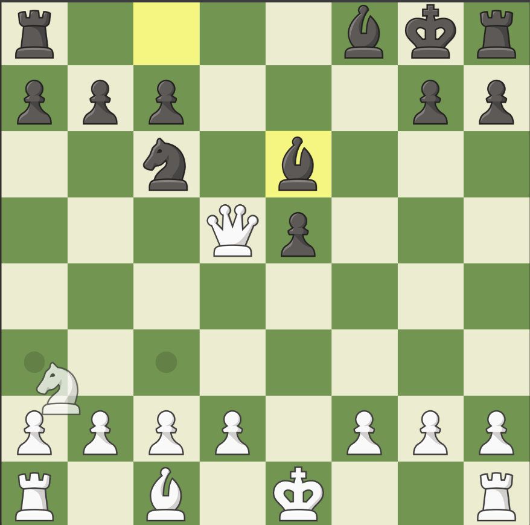

# chess

emcc ./public/cpp/main.cpp -o ./bin/temp.js   -std=c++17  -s MODULARIZE=1     -s ENVIRONMENT=node     -s EXPORTED_FUNCTIONS='["_change_board", "_setB
oardFromFen", "_malloc", "_free"]'     -s EXPORTED_RUNTIME_METHODS='["cwrap", "getValue", "setValue", "UTF8ToString"]'

node testcpp.js

g++ test.cpp -o test -lgtest -lgtest_main -pthread