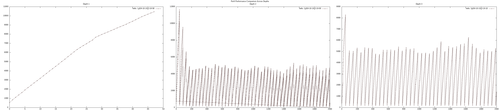

# whats this?

a chess platform coded mainly in cpp and js, that heavily resembles chess.com, served to a web page via nodejs and ngrok, using the performance gains of compiling cpp into wasm.

# what can it do?

allows for online multiplayer, meaning you can play with other ppl online.

has an option to play against a chess bot.

# how do I play?

click the following image

[](https://suarezmanuel.github.io/chess/)

> can you solve the puzzle?

# the chess bot

the bot for now is able to see 0 moves ahead,

it makes use of the following optimizations:
1. nonee
2. none
3. none
4. none

heres the improvement of the bot overtime 

[]()


# misc commands

```
emcc ./public/cpp/main.cpp -o ./bin/temp.js   -std=c++17  -s MODULARIZE=1     -s ENVIRONMENT=node     -s EXPORTED_FUNCTIONS='["_change_board", "_setB
oardFromFen", "_malloc", "_free"]'     -s EXPORTED_RUNTIME_METHODS='["cwrap", "getValue", "setValue", "UTF8ToString"]'

node testcpp.js

g++ test.cpp -o test -lgtest -lgtest_main -pthread
```

# how does it all really work?

## bitboard optimizations

### generating legal moves

a chess board includes two players, and 6 different piece types pawn, knight, bishop, rook, queen, king (pnbrqk)
in order to generate possible moves for each piece we are

#### piece bitboards

for every piece well generate an attack bitboard, common macros well use are `get_bit` and `set_bit`, furthermore we 
defined an enum of the board squares into ints from 0 to 63, meaning a8 is 0, a7 is 1, ... , h1 is 63 and no_move is 64
meaning we can use square locations instead of normal indexing, neat!

#### jumping pieces (pawns, knights, kings)

#### draggable pieces (rooks, bishops, queens)

what characterizes this type of pieces is that they stop whenever something is in their way

##### magic numbers and hashing

in order to create the mask were going to use `get_lsb1` ...

we want to get the correct attack mask but we want somehow a way to precalculate ....

### castling rights

we can encode castling rights for both sides as an int ... represented by ...

### encoding moves

well take into account promotion, ... a move is an int

### occupancy masks

well keep occupancy masks for black, white and both colors 

### move generation

our main algorithm to generate moves denoted by the function `generate_moves` (suprisingly), loops over every bitboard for type of piece piece 
ang for each generates attack boards and adds castling whenever possible by checking the variable `castling_rights` and furthermore that
the pieces 

### handling move making

we make a board to help us with the castling, a board that consists of 64 numbers that well `&` to our `castling_rights` variable
to the rooks, kings based on their positions. making it so if we move the king or if the rooks are eaten we will automatically update the
castling rights.
if we somehow try to make a move thats invalid or we try to ..., it will return 0, meaning !make_move() is true if the move is invalid.

### minimax

#### alpha beta

#### quintisence search